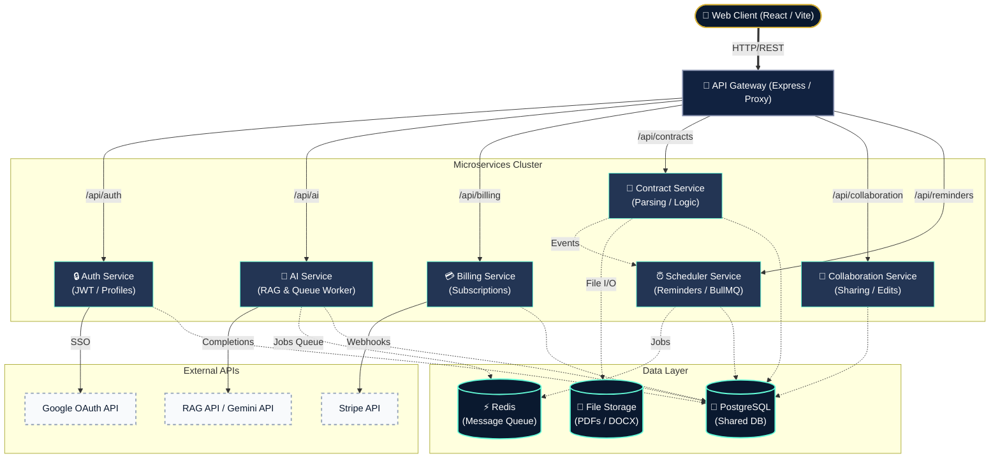
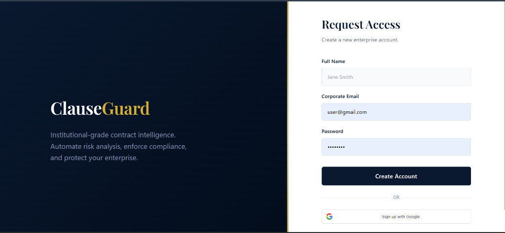
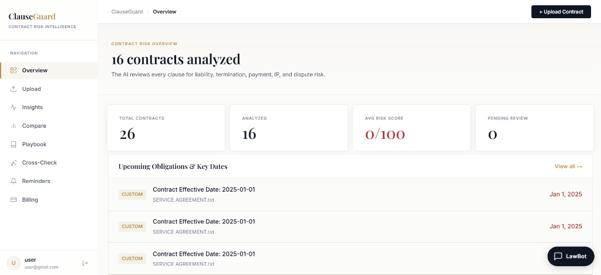
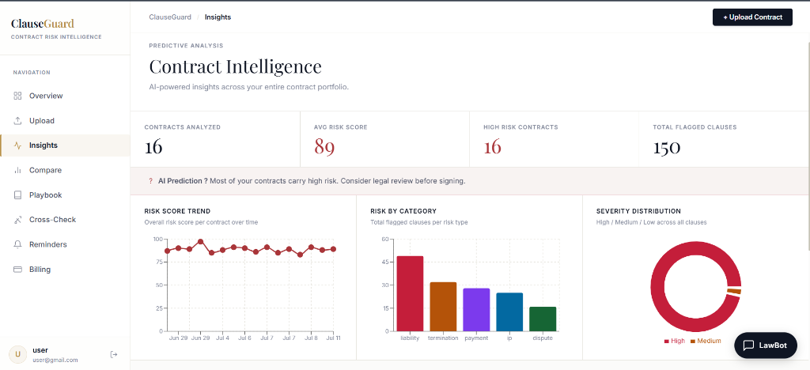
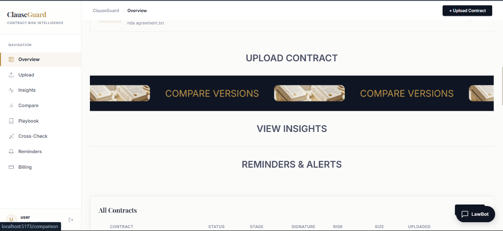
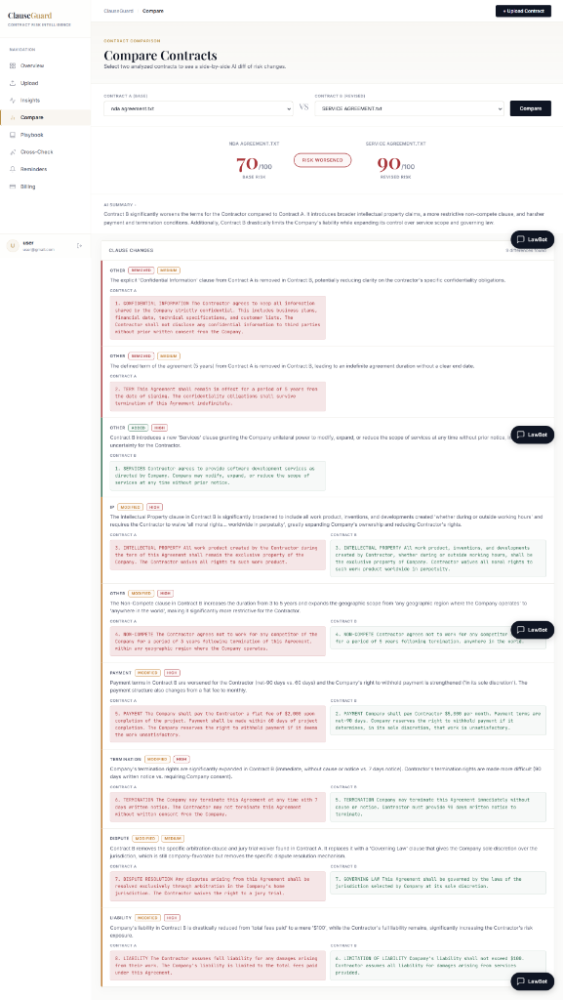
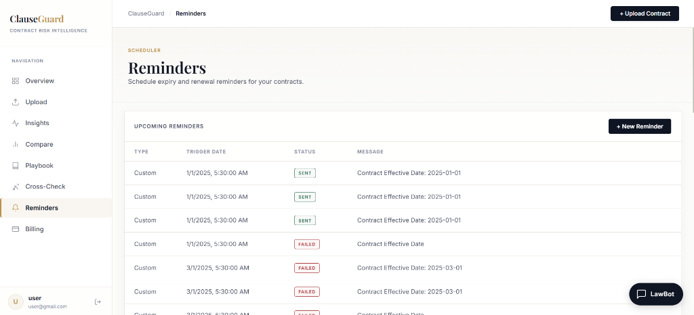
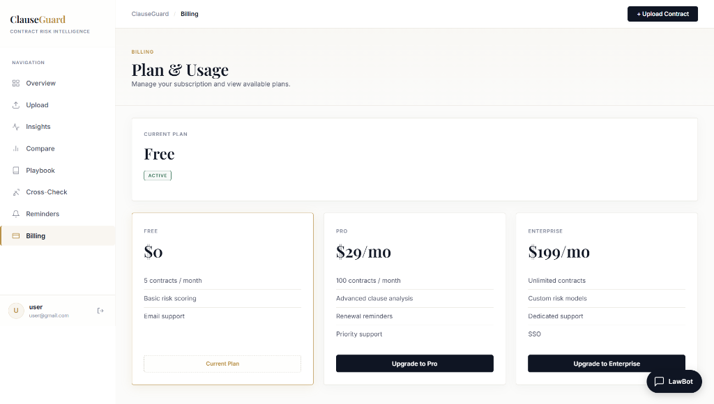

# ClauseGuard 🛡️

ClauseGuard is a cutting-edge, AI-powered contract lifecycle management (CLM) platform designed for enterprise legal teams. By leveraging advanced Large Language Models (LLMs) and a robust microservices architecture, ClauseGuard automates risk analysis, compliance checking, obligation tracking, and contract redlining.

---

## 🌟 Key Features

* **🧠 AI-Powered Risk Analysis (LangChain.js)**: Upload PDF contracts and instantly receive a comprehensive risk breakdown, clause-by-clause analysis, and severity scoring using a structured RAG pipeline designed with Zod and LangChain.js.
* **🎨 Premium Three-Panel Split Showcase**: An interactive vertical-sliding accordion layout mapping ClauseGuard's core pillars (Risk Audit, Playbooks, and Redlining) using clean, unblurred tablet screenshots on realistic desks.
* **📂 Soft Active Showcase Cards**: Vertically aligns process workflows using transparent rows for inactive steps, and smooth curved cards (`border-radius: 16px`) with drop shadows for active steps.
* **💬 Collapsible FAQ Accordion**: Expandable FAQ accordion module with smooth height and chevron transitions.
* **🔑 Split-Card Auth Portal**: Revamped `/login` and `/register` portals utilizing a split-card layout, highlighting key product features and social row paths next to a tab-based authentication form.
* **✉️ Corporate B2B Lead Form**: Tightly integrated enterprise form layout featuring aligned field labels, sentence-case text, and brand-aligned CTA buttons.
* **🔗 Geometric CTA & Footer**: Stunning bottom CTA banner decorated with a linear-gradient CSS geometric outline grid, next to an expanded 4-column corporate footer.
* **📜 Custom Playbook Compliance**: Define custom legal playbooks (e.g., "Standard Payment Terms") and have the AI automatically evaluate incoming contracts against your company's specific compliance rules.
* **⚖️ Cross-Document RAG (Conflict Detection)**: Upload multiple contracts (e.g., an MSA and an SOW) to automatically detect contradictions, overlapping liabilities, and mismatched terms.
* **🎯 Source-Grounded Citations**: Every AI-generated risk flag is mapped back to the exact page number of the original PDF, showing exactly where in the source text the issue was flagged and allowing smooth visual scrolling to highlights.
* **🔍 Semantic & Clause-Aware Chunking (Local RAG)**: Chunks contract text on section boundaries rather than simple token windows, and uses a local vector space TF-IDF retriever to isolate relevant sections for targeted playbook audits.
* **🛡️ Low Confidence Fallbacks**: Detects when context is missing (e.g., governing law not mentioned at all) and triggers an "Insufficient Evidence" alert to warn users rather than hallucinating false results.
* **⚡ Asynchronous Analysis Queue**: Offloads slow AI model calls into a robust background job queue (Bull + Redis), improving system responsiveness and using client-side polling to dynamically display extraction state transitions.
* **✍️ Auto-Redlining**: Generate legally sound, alternative clause suggestions with a click to instantly mitigate identified risks.
* **📅 Smart Obligations & Reminders**: The AI automatically extracts key dates and deliverables from contracts and syncs them with our Scheduler Service to send automated reminders.
* **💳 Enterprise Billing**: Full Stripe integration with a dynamic fallback "Mock Checkout" UI for development environments. Manage subscriptions, upgrade to Pro/Enterprise tiers seamlessly.
* **🎨 Stunning UI/UX**: Built with React and modern CSS, featuring brand-aligned typography (Manrope & Cormorant Garamond), fluid animations, and responsive GSAP-powered layouts.

---

## 🏗️ Architecture

ClauseGuard is built on a highly scalable, fault-tolerant **Microservices Architecture**, orchestrated via an API Gateway.



---

## 🛠️ Technology Stack

### Frontend
- **Framework**: React 18, Vite
- **Typography**: Manrope (Sans-serif) & Cormorant Garamond (Serif)
- **Styling**: CSS Modules, Vanilla CSS
- **Animations**: GSAP, Framer Motion
- **Icons**: Lucide React
- **Routing**: React Router DOM

### Backend (Microservices)
- **Runtime**: Node.js, TypeScript
- **Framework**: Express.js
- **Database**: PostgreSQL (via Sequelize ORM)
- **AI/ML Integrations**: `@google/generative-ai` (RAG), `langchain` (Structured Pipeline)
- **Payments**: Stripe SDK
- **Security**: JWT Authentication, Helmet, Express Rate Limit

---

## 📸 Screenshots

### Request Access

*Enterprise login and registration portal.*

### Dashboard Overview

*High-level summary of analyzed contracts and pending reviews.*

### Upload & AI Extraction

*Drag-and-drop interface for automated text extraction and risk analysis.*

### Contract Insights

*Deep dive into predictive risk scores, severity distribution, and risk trends.*

### All Contracts (Compare Access)

*Centralized repository of all uploaded documents.*

### Side-by-Side Comparison

*AI-driven diff highlighting risk changes between base and revised contracts.*

### Smart Reminders

*Automated tracking and notifications for contract milestones.*

### Billing & Subscription

*Seamless checkout flow and plan management.*

---

## 🚀 Getting Started (Local Development)

### Prerequisites
- Node.js (v18+)
- pnpm (Preferred package manager)
- PostgreSQL (Running locally or via Docker)
- Redis (For background task queues)
- Gemini API Key / RAG API Key
- Stripe Account (Test Keys)

### Environment Setup
Create a `.env` file in the root of each microservice (`api-gateway`, `ai-service`, `billing-service`, `contract-service`, `scheduler-service`) and the `client`. 

*Example for `services/ai-service/.env`:*
```env
PORT=3003
GEMINI_API_KEY=your_gemini_api_key
DB_HOST=localhost
DB_PORT=5432
DB_NAME=clauseguard
DB_USER=postgres
DB_PASSWORD=postgres
JWT_SECRET=clauseguard_jwt_super_secret_change_in_production
CONTRACT_SERVICE_URL=http://localhost:3002
```

### Running the Application

1. **Install Dependencies**
   From the root of the project workspace, run:
   ```bash
   pnpm install
   ```

2. **Start All Services in Parallel**
   From the root directory, run:
   ```bash
   pnpm dev
   ```
   This command starts all background microservices and the frontend client simultaneously. The frontend web interface will be available at `http://localhost:5173`.

---

## 📊 Risk Scoring Evaluation Benchmark

To demonstrate enterprise readiness and verify model classification accuracy, ClauseGuard features a custom evaluation harness that runs an automated classification benchmark over a curated test dataset of 50 contract clauses labeled with their ground-truth severity.

### Benchmark Results
| Risk Tier | Precision | Recall | F1-Score | Total Samples |
| :--- | :---: | :---: | :---: | :---: |
| **LOW** | 81.0% | 85.0% | 82.9% | 20 |
| **MEDIUM** | 55.6% | 35.7% | 43.5% | 14 |
| **HIGH** | 75.0% | 93.8% | 83.3% | 16 |
| **Overall Accuracy** | - | - | **74.0%** | **50** |

You can re-run this benchmark locally from the `services/ai-service` directory using:
```bash
npm run evaluate
```

---

## 🤝 Contributing
Contributions, issues, and feature requests are welcome! Feel free to check the issues page.

## 📄 License
This project is proprietary and confidential. Unauthorized copying of this file, via any medium, is strictly prohibited.
