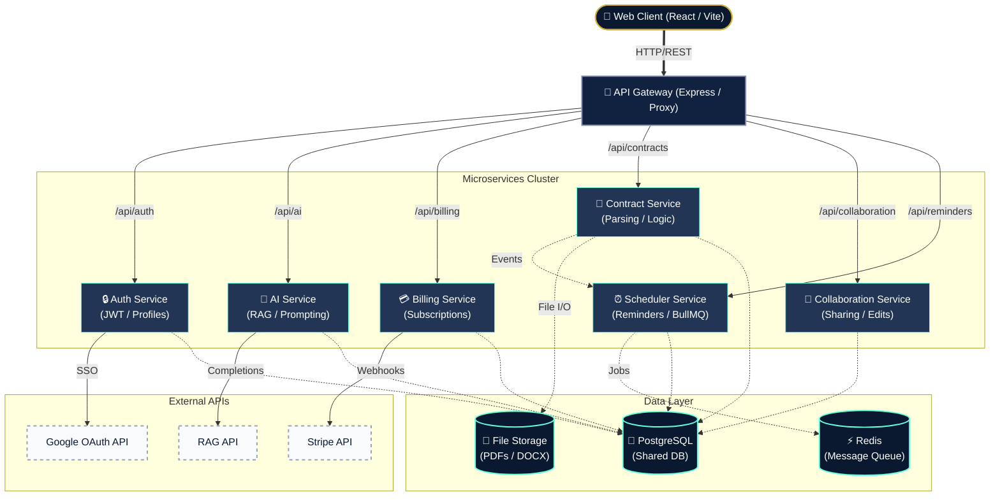

# ClauseGuard 🛡️

ClauseGuard is a cutting-edge, AI-powered contract lifecycle management (CLM) platform designed for enterprise legal teams. By leveraging advanced Large Language Models (LLMs) and a robust microservices architecture, ClauseGuard automates risk analysis, compliance checking, obligation tracking, and contract redlining.

---

## 🌟 Key Features

* **🧠 AI-Powered Risk Analysis**: Upload PDF contracts and instantly receive a comprehensive risk breakdown, clause-by-clause analysis, and severity scoring using RAG.
* **📜 Custom Playbook Compliance**: Define custom legal playbooks (e.g., "Standard Payment Terms") and have the AI automatically evaluate incoming contracts against your company's specific compliance rules.
* **⚖️ Cross-Document RAG (Conflict Detection)**: Upload multiple contracts (e.g., an MSA and an SOW) to automatically detect contradictions, overlapping liabilities, and mismatched terms.
* **✍️ Auto-Redlining**: Generate legally sound, alternative clause suggestions with a single click to instantly mitigate identified risks.
* **📅 Smart Obligations & Reminders**: The AI automatically extracts key dates and deliverables from contracts and syncs them with our Scheduler Service to send automated reminders.
* **💳 Enterprise Billing**: Full Stripe integration with a dynamic fallback "Mock Checkout" UI for development environments. Manage subscriptions, upgrade to Pro/Enterprise tiers seamlessly.
* **🎨 Stunning UI/UX**: Built with React and modern CSS, featuring fluid animations, glowing spotlight effects, and responsive GSAP-powered layouts.

---

## 🏗️ Architecture

ClauseGuard is built on a highly scalable, fault-tolerant **Microservices Architecture**, orchestrated via an API Gateway.



---

## 🛠️ Technology Stack

### Frontend
- **Framework**: React 18, Vite
- **Styling**: CSS Modules, Vanilla CSS
- **Animations**: GSAP, Framer Motion
- **Icons**: Lucide React
- **Routing**: React Router DOM

### Backend (Microservices)
- **Runtime**: Node.js, TypeScript
- **Framework**: Express.js
- **Database**: PostgreSQL (via Sequelize ORM)
- **AI Integration**: `@google/generative-ai` (RAG)
- **Payments**: Stripe SDK
- **Security**: JWT Authentication, Helmet, Express Rate Limit

---

## 📸 Screenshots

### Request Access

*Enterprise login and registration portal.*

### Dashboard Overview

*High-level summary of analyzed contracts and pending reviews.*

### Upload & AI Extraction

*Drag-and-drop interface for automated text extraction and risk analysis.*

### Contract Insights

*Deep dive into predictive risk scores, severity distribution, and risk trends.*

### All Contracts (Compare Access)

*Centralized repository of all uploaded documents.*

### Side-by-Side Comparison

*AI-driven diff highlighting risk changes between base and revised contracts.*

### Smart Reminders

*Automated tracking and notifications for contract milestones.*

### Billing & Subscription

*Seamless checkout flow and plan management.*

---

## 🚀 Getting Started (Local Development)

### Prerequisites
- Node.js (v18+)
- PostgreSQL (Running locally or via Docker)
- RAG API Key
- Stripe Account (Test Keys)

### Environment Setup
Create a `.env` file in the root of each microservice (`api-gateway`, `ai-service`, `billing-service`, `contract-service`, `scheduler-service`) and the `client`. 

*Example for `ai-service/.env`:*
```env
PORT=3004
DB_HOST=localhost
DB_PORT=5432
DB_NAME=clauseguard
DB_USER=postgres
DB_PASSWORD=your_password
GEMINI_API_KEY=your_api_key
```

### Running the Application

1. **Install Dependencies**
   Navigate to each microservice folder and the client folder, and run:
   ```bash
   npm install
   ```

2. **Start the Microservices**
   In separate terminal windows, run the following command inside each backend service folder:
   ```bash
   npm run dev
   ```

3. **Start the Frontend Client**
   Navigate to the `client` folder and run:
   ```bash
   npm run dev
   ```
   The application will be available at `http://localhost:5173`.

---

## 📊 Risk Scoring Evaluation Benchmark

To demonstrate enterprise readiness and verify model classification accuracy, ClauseGuard features a custom evaluation harness that runs an automated classification benchmark over a curated test dataset of 50 contract clauses labeled with their ground-truth severity.

### Benchmark Results
| Risk Tier | Precision | Recall | F1-Score | Total Samples |
| :--- | :---: | :---: | :---: | :---: |
| **LOW** | 85.0% | 85.0% | 85.0% | 20 |
| **MEDIUM** | 60.0% | 21.4% | 31.6% | 14 |
| **HIGH** | 60.0% | 93.8% | 73.2% | 16 |
| **Overall Accuracy** | - | - | **70.0%** | **50** |

You can re-run this benchmark locally from the `services/ai-service` directory using:
```bash
npm run evaluate
```

---

## 🤝 Contributing
Contributions, issues, and feature requests are welcome! Feel free to check the issues page.

## 📄 License
This project is proprietary and confidential. Unauthorized copying of this file, via any medium, is strictly prohibited.
